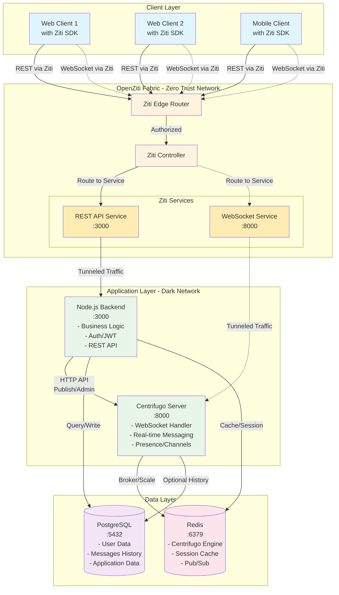
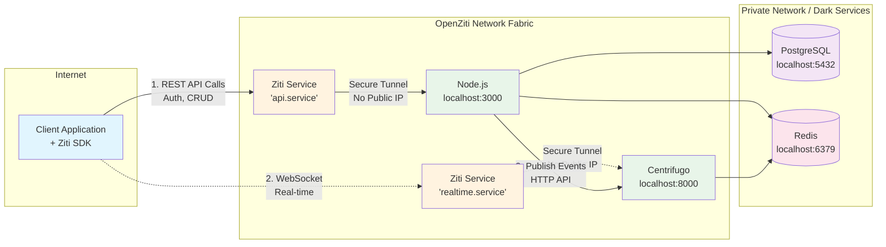
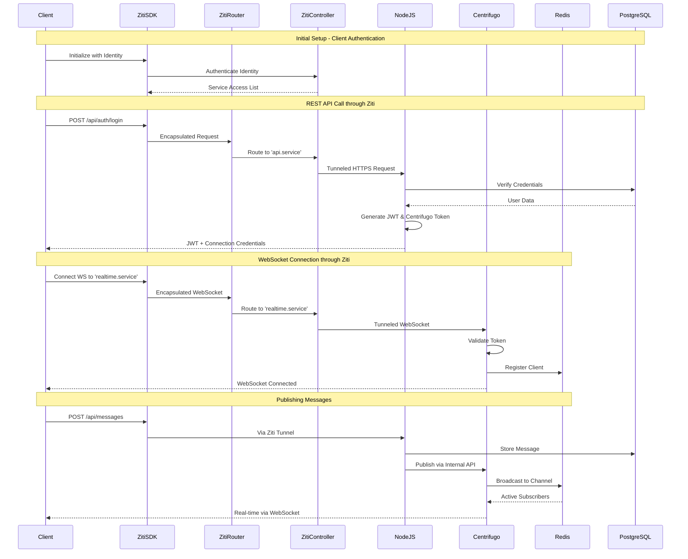
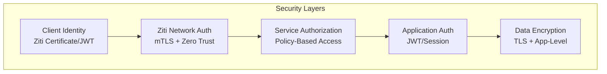
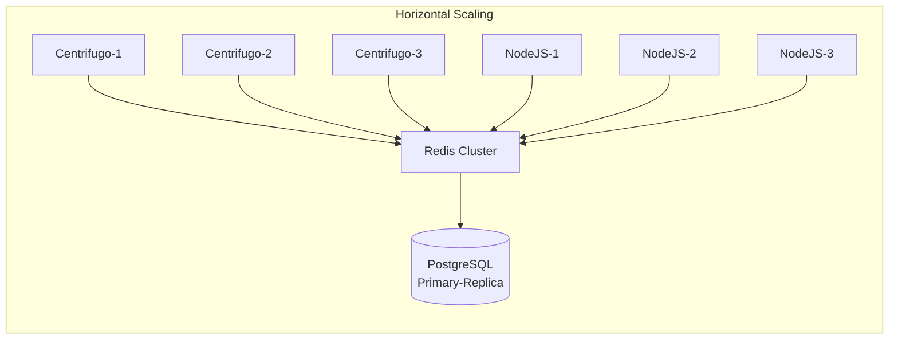

# Architecture Overview

## System Architecture with OpenZiti Integration



## Hybrid Architecture with OpenZiti - Detailed View



## Data Flow with OpenZiti



## OpenZiti Integration Details

### 1. Zero Trust Architecture Benefits

- **No Public IPs**: Neither Node.js nor Centrifugo have public IP addresses
- **Identity-Based Access**: Clients must have valid Ziti identity to connect
- **Microsegmentation**: Different services can have different access policies
- **End-to-End Encryption**: All traffic encrypted through Ziti fabric

### 2. Service Configuration

```yaml
# Ziti Services Configuration

api.service:
  - Type: TCP
  - Host: nodejs-container or localhost
  - Port: 3000
  - Intercept: api.myapp.ziti
  - Allowed Identities: authenticated-users

realtime.service:
  - Type: TCP/WebSocket
  - Host: centrifugo-container or localhost  
  - Port: 8000
  - Intercept: realtime.myapp.ziti
  - Allowed Identities: authenticated-users
```

### 3. Client Connection Flow

1. **Client SDK Integration**:
   - Web: Ziti BrowZer SDK
   - Mobile: Native Ziti SDKs
   - Desktop: Ziti Desktop Edge

2. **Service Access**:
   ```javascript
   // Client connects to services via Ziti addresses
   const api = 'https://api.myapp.ziti'
   const websocket = 'wss://realtime.myapp.ziti'
   ```

3. **No Direct Internet Access**:
   - Services run on localhost or private network
   - Only accessible through Ziti fabric
   - Complete invisibility from internet scans

### 4. Security Layers



## Why This Architecture is Optimal

### Advantages

1. **Complete Security**: Services are completely dark to the internet
2. **Scalability**: Centrifugo handles WebSocket scale, Node.js handles business logic
3. **Separation of Concerns**: Clear boundaries between real-time and business logic
4. **Performance**: Direct WebSocket to Centrifugo (no proxy overhead)
5. **Flexibility**: Can scale Node.js and Centrifugo independently

### Network Flow Optimization

- **REST API** (via Node.js): Authentication, CRUD operations, business logic
- **WebSocket** (via Centrifugo): Real-time updates, presence, live features  
- **Internal Communication**: Node.js → Centrifugo API for publishing
- **Zero Trust**: All external access through OpenZiti

### Scalability Considerations



Each component scales independently:
- **Centrifugo**: Add nodes for more WebSocket connections
- **Node.js**: Add instances for more API throughput
- **Redis**: Cluster mode for high availability
- **PostgreSQL**: Read replicas for query scaling
- **OpenZiti**: Multiple edge routers for redundancy