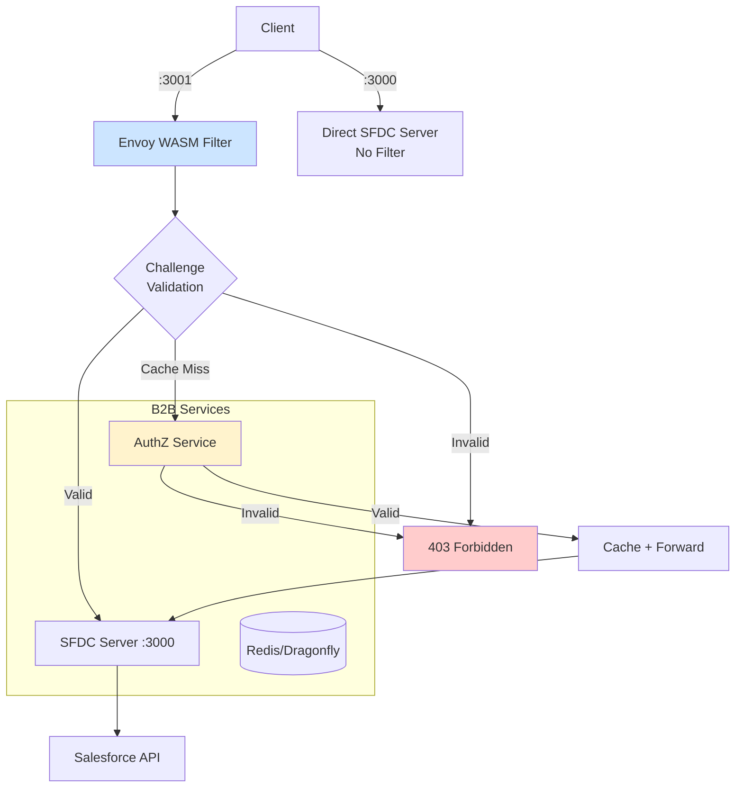

# B2B SFDC Server - Envoy WASM Filter Integration

This document describes the integration of the B2B SFDC server with the Envoy WASM filter for enhanced security through challenge-response authentication.

## 🏗️ Architecture



## 🚢 Services

### Core Services
- **pzero-sfdc-server**: Main SFDC integration server (port 3000)
- **dragonfly**: Redis-compatible database for caching
- **authz-service**: Challenge validation service  
- **pzero-b2b-envoy**: Envoy proxy with WASM filter (port 3001)

### Port Configuration
- **3000**: Direct SFDC server access (no filtering)
- **3001**: Envoy-filtered access (with challenge validation)
- **9903**: Envoy admin interface

## 🔐 Security Flow

### Public Routes (No Challenge Required)
- `/auth/*` - GitHub OAuth endpoints
- `/health` - Health checks

### Protected Routes (Challenge Required)
- `/salesforce/*` - All Salesforce API operations
- All other endpoints

### Challenge Headers Required
- `x-challenge-id`: Unique challenge identifier
- `x-challenge-answer`: Challenge response value

## 🚀 Usage

### Development (No Security)
```bash
curl http://localhost:3000/auth/me
```

### Production (With Security)
```bash
curl -H "x-challenge-id: challenge123" \
     -H "x-challenge-answer: answer456" \
     http://localhost:3001/salesforce/Account/query
```

## 🛠️ Setup

### Environment Variables
Add to your `.env` file:
```env
# Challenge validation (required)
CHALLENGE_SECRET=your-super-secret-challenge-key

# Redis connection 
REDIS_URL=redis://dragonfly:6379

# AuthZ service
AUTHZ_SERVICE_URL=http://pzero-b2b-authz-service:3000
```

### Network Setup
Ensure the external network exists:
```bash
docker network create pzero-network
```

### Start Services
```bash
# Start all services including Envoy filter
docker-compose up -d

# Check service status
docker-compose ps
```

## 🧪 Testing

### 1. Health Check (Public Route)
```bash
# Direct access (should work)
curl http://localhost:3000/health

# Filtered access (should work - no challenge required)
curl http://localhost:3001/health
```

### 2. Authentication (Public Route)
```bash
# GitHub OAuth (should work through filter)
curl http://localhost:3001/auth/login
```

### 3. Protected Endpoints
```bash
# Without challenge headers (should fail with 403)
curl http://localhost:3001/salesforce/Account/query

# With valid challenge headers (should work)
curl -H "x-challenge-id: valid-id" \
     -H "x-challenge-answer: valid-answer" \
     -H "Cookie: accessToken=your-jwt-token" \
     http://localhost:3001/salesforce/Account/query
```

## 🔍 Monitoring

### Envoy Admin Interface
```bash
# Access admin interface
curl http://localhost:9903/stats

# Check cluster health
curl http://localhost:9903/clusters
```

### Service Logs
```bash
# SFDC server logs
docker-compose logs pzero-sfdc-server

# Envoy proxy logs  
docker-compose logs pzero-b2b-envoy

# AuthZ service logs
docker-compose logs authz-service
```

## 🎯 Benefits

### Security
- ✅ **Challenge-response authentication** for all protected endpoints
- ✅ **Caching** reduces AuthZ service load
- ✅ **Public route bypass** for OAuth and health checks

### Performance  
- ✅ **Fast validation** via Redis caching
- ✅ **Async processing** prevents blocking
- ✅ **Configurable TTL** for cache entries

### Operational
- ✅ **Both access methods** available (direct + filtered)
- ✅ **Zero code changes** to SFDC server
- ✅ **Standard Envoy** monitoring and administration

## 🐛 Troubleshooting

### Common Issues

**403 Forbidden on protected routes**
- Check challenge headers are included
- Verify AuthZ service is running
- Check CHALLENGE_SECRET matches between services

**Service unreachable errors**
- Verify Docker network connectivity
- Check service dependencies in docker-compose
- Ensure all services are healthy

**Cache issues**
- Check Redis/Dragonfly connectivity
- Verify REDIS_URL configuration
- Monitor cache hit/miss ratios via Envoy stats