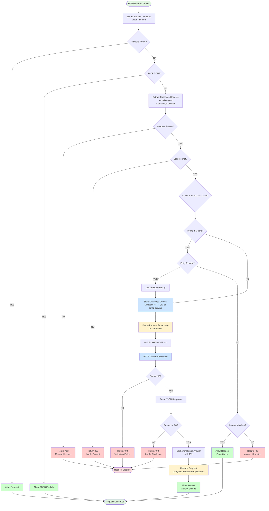
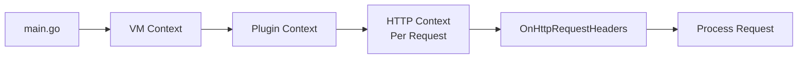
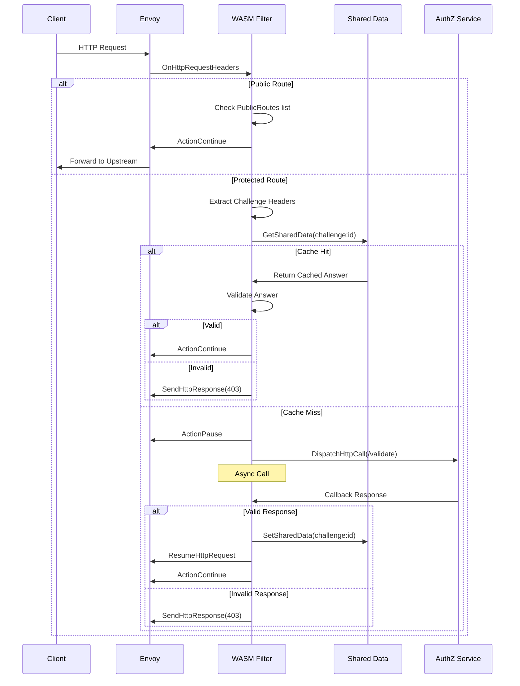
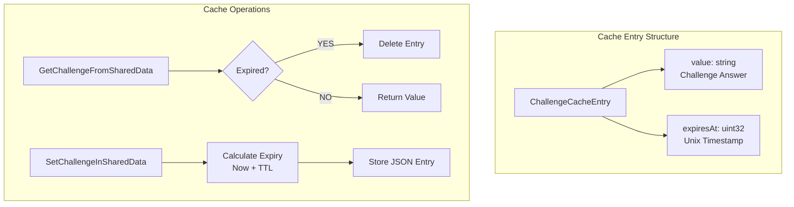
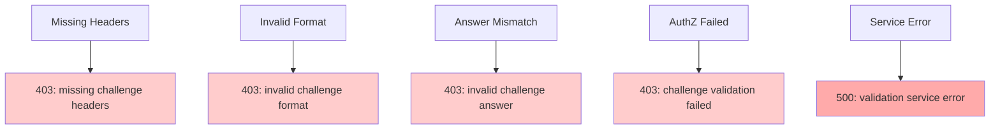

# Envoy WASM Filter - Challenge Authentication Flow

## Overview

This Go-based WASM filter implements a challenge-response authentication system for Envoy proxy. It validates incoming requests using challenge headers and maintains a cache of validated challenges for performance optimization.

## Architecture Flow



## Component Details

### 1. Main Entry Point (`main.go`)

The filter initializes through the proxy-wasm SDK:



### 2. Request Processing Pipeline



### 3. Public Routes

The filter bypasses validation for:
- `/health` (exact match)
- `/auth/*` (prefix)
- `/centrifugo/*` (prefix)
- `/sms/*`, `/email/*` (prefixes)
- `/proxy/auth/login`, `/proxy/auth/callback`, `/proxy/auth/refresh`
- `/faq`, `/terms` (exact)
- `/public/*`, `/docs/*`, `/assets/*`
- All `OPTIONS` requests (CORS)

### 4. Shared Data Cache



### 5. HTTP Client Integration

```mermaid
flowchart LR
    subgraph Async HTTP Call
        Dispatch[DispatchHttpCall] --> Headers[Set Headers<br/>:method, :path, :authority]
        Headers --> Body[JSON Body<br/>challengeId, challengeAnswer]
        Body --> Send[Send to authz_cluster]
        Send --> Timeout[5 second timeout]
        Timeout --> CB[Callback Function]
    end
    
    subgraph Callback Processing
        CB --> Status[Parse Status Code]
        Status --> RespBody[Get Response Body]
        RespBody --> Parse[Parse JSON]
        Parse --> Validate[Check OK field]
        Validate --> Cache[Cache if Valid]
        Cache --> Resume[Resume Request]
    end
```



## Key Features

### Security
- **Challenge Validation**: All non-public routes require valid challenge headers
- **Answer Verification**: Validates challenge answers against expected values
- **Cache Security**: TTL-based expiry prevents stale challenges

### Performance
- **Shared Data Cache**: Reduces authz-service calls for repeated challenges
- **TTL Management**: Automatic cleanup of expired entries
- **Async Processing**: Non-blocking HTTP calls to authz-service

### Resilience
- **Fallback to AuthZ**: Cache miss triggers validation via external service
- **Error Handling**: Graceful degradation on service failures
- **CORS Support**: Automatic OPTIONS request passthrough

## Configuration

### Environment Variables
- **authz_cluster**: Envoy cluster configuration for authz-service
- **Default TTL**: 3600 seconds (1 hour)

### Headers
- **Request Headers**:
  - `x-challenge-id`: Unique challenge identifier
  - `x-challenge-answer`: Challenge response value
  
- **Response Headers**:
  - `x-challenge-ttl`: Optional TTL override (from authz-service)

## Error Scenarios



## Build and Deployment

### Build Process
```bash
# Compile with TinyGo
tinygo build -o filter.wasm -scheduler=none -target=wasi main.go

# Docker multi-stage build
docker build -t envoy-wasm-filter .
```

### Envoy Configuration
```yaml
http_filters:
  - name: envoy.filters.http.wasm
    typed_config:
      "@type": type.googleapis.com/envoy.extensions.filters.http.wasm.v3.Wasm
      config:
        root_id: challenge_handler
        vm_config:
          vm_id: challenge_handler
          runtime: envoy.wasm.runtime.v8
          code:
            local:
              filename: /etc/envoy/filter.wasm
```

## Testing

### Manual Testing Flow
1. Send request without headers → Expect 403
2. Send request with invalid headers → Expect 403
3. Send valid challenge → Expect pass + cache
4. Repeat same challenge → Expect cache hit
5. Wait for TTL expiry → Expect cache miss

### Load Testing Considerations
- Monitor shared data memory usage
- Check authz-service latency impact
- Validate cache hit/miss ratios
- Test concurrent request handling