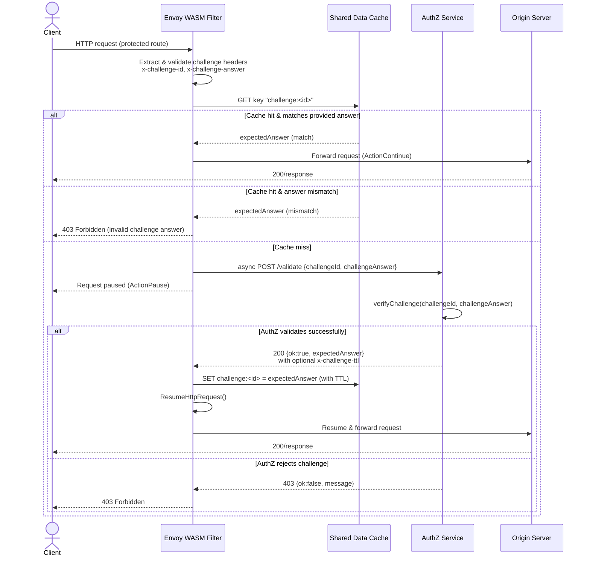
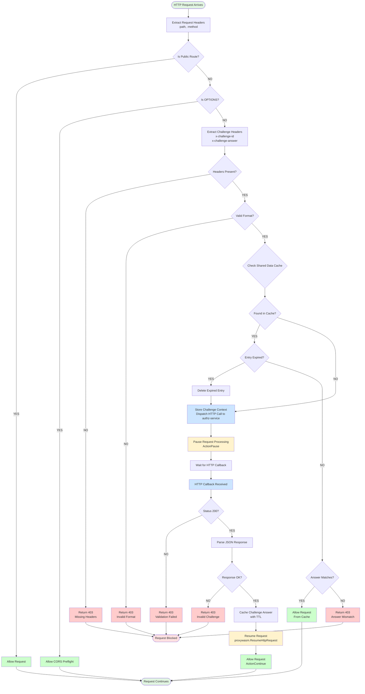
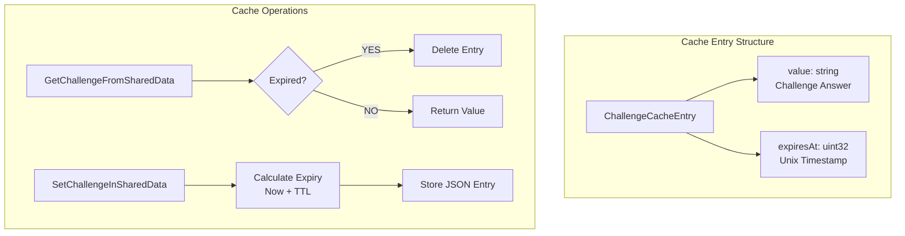
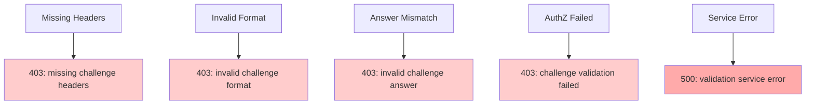

# Envoy WASM Filter

A Go-based Envoy WASM filter that implements a challenge-response authentication system for Envoy proxy. It validates incoming requests using challenge headers and maintains a cache of validated challenges for performance optimization.

## Overview

This WASM filter validates challenge headers (`x-challenge-id` and `x-challenge-answer`) using Envoy's shared data cache with fallback to the authz-service via async HTTP calls. The filter provides fast in-memory lookups for repeated challenges while ensuring security through TTL-based cache expiry.

## Prerequisites

- Go 1.21 or later
- TinyGo (for WASM compilation)
  - Install: `brew install tinygo` (macOS) or download from [tinygo.org](https://tinygo.org/getting-started/install/)

## Building

Install Go dependencies and build the filter:

```bash
cd packages/envoy-wasm-filter
make build
```

This will compile the Go code to `build/filter.wasm` using TinyGo.

## Architecture Flow



## Detailed Processing Flow



## Filter Behavior

### 1. Public Routes
Bypasses validation for public routes:
- `/health` (exact match)
- `/auth/*` (prefix)
- `/centrifugo/*` (prefix)
- `/sms/*` (prefix)
- `/email/*` (prefix)
- `/proxy/auth/login` (prefix)
- `/proxy/auth/callback` (prefix)
- `/proxy/auth/refresh` (prefix)
- `/faq` (exact match)
- `/terms` (exact match)
- `/public/*` (prefix)
- `/docs/*` (prefix)
- `/assets/*` (prefix)
- OPTIONS requests (CORS preflight)

### 2. Protected Routes
Requires `x-challenge-id` and `x-challenge-answer` headers:
- First checks Envoy shared data cache (fast in-memory lookup)
- If cache miss, makes async HTTP call to `authz-service:3000/validate`
- Caches successful validations in shared data with TTL (3600s default)
- Returns 403 if validation fails

## Shared Data Cache

The filter uses Envoy's shared data for high-performance caching:



## Key Features

### Security
- **Challenge Validation**: All non-public routes require valid challenge headers
- **Answer Verification**: Validates challenge answers against expected values
- **Cache Security**: TTL-based expiry prevents stale challenges

### Performance
- **Shared Data Cache**: Reduces authz-service calls for repeated challenges
- **TTL Management**: Automatic cleanup of expired entries
- **Async Processing**: Non-blocking HTTP calls to authz-service

### Resilience
- **Fallback to AuthZ**: Cache miss triggers validation via external service
- **Error Handling**: Graceful degradation on service failures
- **CORS Support**: Automatic OPTIONS request passthrough

## Error Scenarios



## Configuration

### Environment Variables
- **authz_cluster**: Envoy cluster configuration for authz-service
- **Default TTL**: 3600 seconds (1 hour)

### Headers
- **Request Headers**:
  - `x-challenge-id`: Unique challenge identifier
  - `x-challenge-answer`: Challenge response value
  
- **Response Headers**:
  - `x-challenge-ttl`: Optional TTL override (from authz-service)

### Envoy Configuration
```yaml
http_filters:
  - name: envoy.filters.http.wasm
    typed_config:
      "@type": type.googleapis.com/envoy.extensions.filters.http.wasm.v3.Wasm
      config:
        root_id: challenge_handler
        vm_config:
          vm_id: challenge_handler
          runtime: envoy.wasm.runtime.v8
          code:
            local:
              filename: /etc/envoy/filter.wasm
```

## Usage

The compiled WASM file is mounted into the Envoy container at `/etc/envoy/wasm/challenge-authz.wasm` and configured in `packages/server/envoy-wasm.yaml`.

The WASM filter runs in a separate Envoy container (`pzero-envoy-wasm`) on port 8182 (external) → 8081 (internal).

## Testing

### Quick Test

Run a simple smoke test:

```bash
./quick-test.sh
```

This tests:
- Public route bypass
- Protected route rejection without challenge
- Valid challenge acceptance
- Invalid challenge rejection

### Full Test Suite

Run comprehensive tests:

```bash
./test-filter.sh
```

This tests:
- Public route bypass for all public routes
- Protected routes without challenge headers
- Invalid challenge scenarios
- Valid challenge validation (cache miss and cache hit)
- Direct `/validate` endpoint testing
- Error cases

### Manual Testing Flow
1. Send request without headers → Expect 403
2. Send request with invalid headers → Expect 403
3. Send valid challenge → Expect pass + cache
4. Repeat same challenge → Expect cache hit
5. Wait for TTL expiry → Expect cache miss

### Environment Variables

You can customize the test URLs:

```bash
ENVOY_WASM_URL=http://localhost:8182 \
AUTHZ_SERVICE_URL=http://localhost:3002 \
CHALLENGE_SECRET=your-secret \
./test-filter.sh
```

### Load Testing Considerations
- Monitor shared data memory usage
- Check authz-service latency impact
- Validate cache hit/miss ratios
- Test concurrent request handling

## Development

The filter is written in Go using the [proxy-wasm-go-sdk](https://github.com/proxy-wasm/proxy-wasm-go-sdk).

### Build Process

**Requirements:**
- Go 1.24+ (for WASI support)
- Target: `GOOS=wasip1 GOARCH=wasm`

```bash
# Compile with upstream Go (requires Go 1.24+)
GOOS=wasip1 GOARCH=wasm go build -o filter.wasm ./src

# Build using Makefile
make build

# Docker multi-stage build
docker build -t envoy-wasm-filter .
```

**Note:** The new proxy-wasm/proxy-wasm-go-sdk requires upstream Go 1.24+ with WASI support, not TinyGo.

## Architecture

- **Shared Data Cache**: Fast in-memory lookups using Envoy's shared data (per-worker)
- **HTTP Fallback**: Async calls to authz-service when cache misses
- **TTL**: 3600 seconds (1 hour) matching Redis TTL
- **Async Processing**: Non-blocking HTTP calls using `DispatchHttpCall`