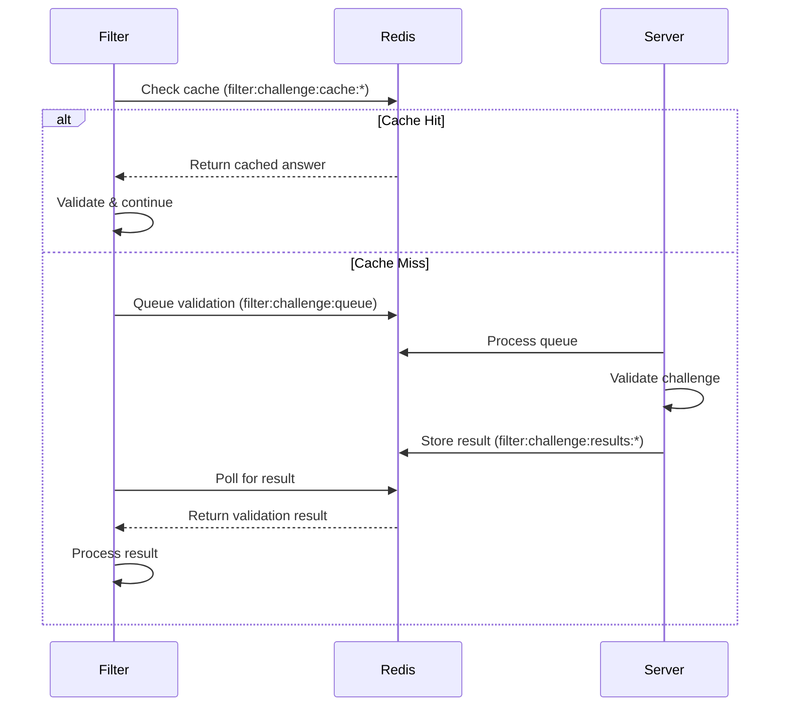

# Redis Communication Architecture

## Overview

The envoy-wasm-filter and server communicate through Redis, providing a scalable and efficient data sharing mechanism. This approach eliminates the need for direct HTTP/2 or WebSocket connections between the filter and server.

## Architecture

```
┌─────────────────┐          ┌─────────────────┐
│  Envoy WASM     │          │    Server       │
│     Filter      │          │   (Node.js)     │
└────────┬────────┘          └────────┬────────┘
         │                            │
         │     ┌──────────────┐      │
         └─────►    Redis     ◄──────┘
               │   Database   │
               └──────────────┘
```

## Redis Data Structures

### 1. **Active Users** (`filter:header:info` → users field)
```json
{
  "uid1": {
    "uid": "uid1",
    "is_act": true,
    "last_active": 1703332800000
  },
  "uid2": {
    "uid": "uid2", 
    "is_act": false,
    "last_active": 1703332700000
  }
}
```

### 2. **Active Endpoints** (`filter:header:info` → endpoints field)
```json
{
  "uid1-endpoint-123": {
    "id": "uid1-endpoint-123",
    "uid": "uid1",
    "is_act": true,
    "last_active": 1703332800000,
    "next_function": "func-456",
    "answer": "response-data"
  }
}
```

### 3. **Next Functions** (`filter:header:info` → functions field)
```json
{
  "func-456": {
    "id": "uid1-endpoint-123",
    "functions": [
      {
        "id": "next-func-1",
        "answer": "answer1"
      },
      {
        "id": "next-func-2",
        "answer": "answer2"
      }
    ]
  }
}
```

## Communication Flow

### 1. Server → Redis → Filter

**Server Updates Data:**
```typescript
// Server updates user status
await headerInfoCache.setActiveUser(uid, { is_act: true, last_active: Date.now() });
await filterRedisService.updateHeaderInfo('users', activeUsers);
```

**Filter Reads Data:**
```go
// Filter retrieves header info from Redis
headerInfo, err := GetHeaderInfoFromRedis()
activeUsers := headerInfo["active_users"]
```

### 2. Challenge Validation Flow



### 3. Filter Registration & Heartbeat

```go
// Filter registers on startup
RegisterFilterInRedis() // Stores in filter:registry

// Periodic heartbeat (every 30s recommended)
SendHeartbeatToRedis() // Updates filter:heartbeat:filterID
```

## Security Features

### 1. **Token-Based Authentication**
- Filters authenticate using HMAC-signed tokens
- Tokens include timestamp and nonce for replay protection
- Shared secret between filter and server

### 2. **Rate Limiting**
- Per-filter rate limits (1000 requests/minute default)
- Implemented using Redis INCR with TTL

### 3. **Access Control**
- Redis proxy validates filter tokens
- Limited command set exposed through proxy
- Separate Redis database or namespace for filter data

## Redis Keys Reference

| Key Pattern | Type | Purpose | TTL |
|------------|------|---------|-----|
| `filter:header:info` | Hash | Header information storage | None |
| `filter:challenge:queue` | List | Pending validation requests | None |
| `filter:challenge:results:*` | String | Validation results | 30s |
| `filter:challenge:cache:*` | String | Cached valid challenges | 300s |
| `filter:registry` | Hash | Registered filters | None |
| `filter:heartbeat:*` | String | Filter heartbeats | 60s |
| `filter:ratelimit:*` | String | Rate limit counters | 60s |

## Configuration

### Server Environment Variables
```bash
REDIS_URL=redis://localhost:6379
JWT_SECRET=your-secret-key  # Used for filter token generation
```

### Envoy Configuration
```yaml
clusters:
  - name: redis_cluster
    connect_timeout: 30s
    type: LOGICAL_DNS
    lb_policy: ROUND_ROBIN
    load_assignment:
      cluster_name: redis_cluster
      endpoints:
      - lb_endpoints:
        - endpoint:
            address:
              socket_address:
                address: server  # Server acts as Redis proxy
                port_value: 8090
```

### Filter Constants (in Go code)
```go
const (
    redisCluster = "redis_cluster"
    filterID     = "wasm-filter-1"
    jwtSecret    = "your-secret-key"
)
```

## Performance Considerations

### 1. **Caching Strategy**
- Challenge results cached for 5 minutes
- Header info cached in filter's shared data
- Redis cache reduces auth service load

### 2. **Polling vs Push**
- Filter polls for challenge results (max 5 seconds)
- Header updates via Redis pub/sub notifications
- Heartbeat maintains connection status

### 3. **Connection Pooling**
- Server maintains persistent Redis connections
- Filter uses HTTP proxy to avoid direct Redis connections
- Connection reuse for better performance

## Monitoring

### Filter Statistics Endpoint
```bash
GET /redis-proxy/filter-stats

Response:
{
  "total": 3,
  "active": 2,
  "inactive": 1,
  "filters": [{
    "filterId": "wasm-filter-1",
    "status": "active",
    "lastHeartbeat": "2024-01-01T12:00:00Z",
    "uptime": 3600000
  }]
}
```

### Redis Monitoring
```bash
# Check filter registration
redis-cli HGETALL filter:registry

# Monitor challenge queue
redis-cli LLEN filter:challenge:queue

# Check header info
redis-cli HGET filter:header:info users
```

## Advantages Over HTTP/2

1. **Scalability**: Redis handles thousands of concurrent connections efficiently
2. **Caching**: Built-in caching reduces repeated validations
3. **Persistence**: Data survives filter/server restarts
4. **Performance**: Redis in-memory operations are extremely fast
5. **Simplicity**: No complex connection management needed
6. **Monitoring**: Redis provides built-in monitoring tools

## Troubleshooting

### Common Issues

1. **Filter Not Receiving Updates**
   - Check Redis connectivity: `redis-cli ping`
   - Verify filter token is valid
   - Check rate limits aren't exceeded

2. **Challenge Validation Timeout**
   - Check Redis queue processing: `LLEN filter:challenge:queue`
   - Verify server is processing queue
   - Check result TTL hasn't expired

3. **Stale Header Information**
   - Verify sync triggers on updates
   - Check Redis pub/sub notifications
   - Validate filter polling intervals

## Security Notes

⚠️ **Important Security Considerations:**

1. Never expose Redis directly to filters - always use the proxy
2. Rotate JWT secrets regularly
3. Monitor rate limits and adjust as needed
4. Use Redis ACLs in production
5. Enable Redis persistence for critical data
6. Use TLS for Redis connections in production